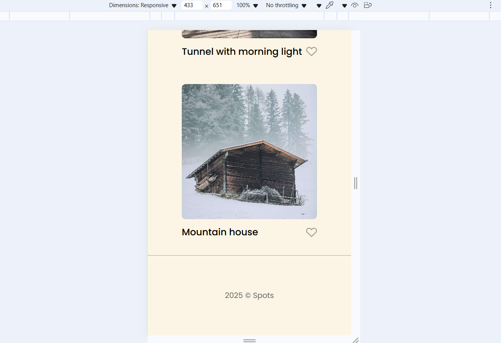

# Project 3: Spots

## Description

Spots is a responsive "photo-sharing" gallery web app. Users can:

- View a header with their role ("Civil Aviator"), an **Edit Profile** link and a **+ New Post** button
- Browse photo cards (image, titlem short description)
- See hover effects on cards
- Enjoy a 3-column grid on desktop, 2-column on tablet, 1-column on mobile
- Experience text truncation with ellipses on long descriptions

## Technologies & Techniques Used

- **HTML** (semantic tags like '<header>', '<section>', '<nav>', '<main>', etc)
- **CSS**:
  - CSS Grid ('grid-template-columns: repeat(auto-fit, minmax(300px,1fr));')
  - Flexbox ('display: flex; aglin-items:center; justify-content: space-between;')
  - Media queries for desktop/tablet/mobile breakpoints
  - 'text-overflow: ellpsis; white-space: nowrap; overflow: hidden;'
- **normalize.css** for cross-brower reset
- **Google Fonts** (Poppins) with system-font fallbacks
- **BEM** naming convention for modular, maintainable CSS
- **Deployed** via Github Pages

## Figma

- [Link to the project on Figma](https://www.figma.com/file/BBNm2bC3lj8QQMHlnqRsga/Sprint-3-Project-%E2%80%94-Spots?type=design&node-id=2%3A60&mode=design&t=afgNFybdorZO6cQo-1)

## Images & Screenshots

## Images

### Desktop View

### Tablet View

### Mobile View

## Live Demo & Video

Check out the live site on GitHub Pages:

Check out the Recorded Video:

